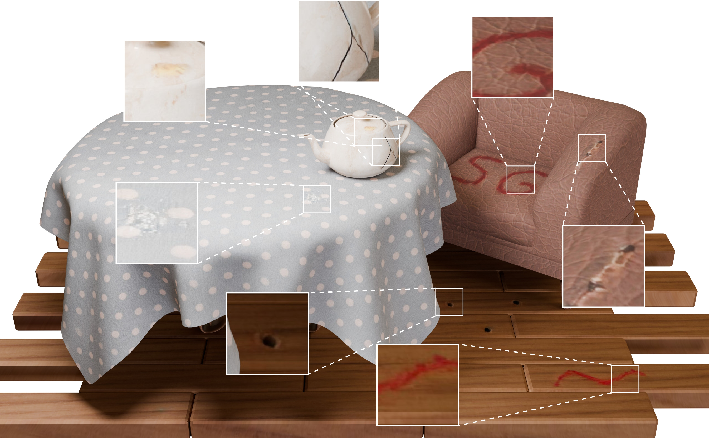

# Example-Based Feature Painting on Textures (SIGGRAPH Asia 2025)

### [Project Page](https://reality.tf.fau.de/pub/ardelean2025examplebased.html) | [arXiv](https://arxiv.org/abs/2511.01513)

This is the official implementation of *Example-Based Feature Painting on Textures*.



## ✨ New Update ✨

---

🎨 Added a Blender add-on to see this project in action more easily: see [Blender](Blender/README.md).

⚡ Also added two texture models to try out the demo without having to train your own network first.
  * To use these weights download the archive from [Google Drive here](https://drive.google.com/file/d/1iRjCXRjIykGGeBxHcPDSeslIsHvQjfWO/view?usp=sharing).
  * Then simply unzip the content into the `synthesis-runs` directory.
---

## 🚀 Installation
We provide the `pyprohect.toml` file for an easy environment setup using [uv](https://docs.astral.sh/uv/).
To get started, simply clone the repository and use `uv sync` to create the virtual environment.
```bash
cd FeaturePainting
uv sync
```
To load both parts of this project to the PYTHONPATH, please set the `uv` environment directory:
```bash
export UV_ENV_FILE=.uvenv
```

## 📂 Data
We provide one of our captures as template under `datasets/blueb`.

In order to run our method on MVTecAD, please download it from [here](https://www.mvtec.com/company/research/datasets/mvtec-ad) and link the `mvtec_anomaly_detection` directory as a subfolder to `datasets`.

To try the method on your own textures, just place the image folder in `datasets`.

## 📊 How to run

The repository is structured in two parts. The first one (`anomaly_segmentation`) contains the logic for anomaly localization, contrastive learning, and semantic segmentation.
The second one (`synthesis`) contains the scripts for training the diffusion model, arbitrarily-large texture generation, and feature transfer.

### 🔍 Anomaly/Feature Segmentation
The first step is to train a VAE on the images and extract the residuals. 
```bash
# For an image folder dataset run
uv run anomaly_segmentation/train_vae.py simple <folder_name>
# For MVTec use
uv run anomaly_segmentation/train_vae.py mvtec <object_name>
```

After extracting residual maps, we use FCA to get anomaly scores for all images.
```bash
# For an image folder dataset
uv run anomaly_segmentation/anomaly_segmentation.py dataset=simple dataset.name=blueb features=cached features.fe_tag=VAE save_alpha_tiff=True track=fca_va
# For MVTec
uv run anomaly_segmentation/dataset_inference.py dataset=mvtec dataset.object_name=<object_name> features=cached features.fe_tag=VAE save_alpha_tiff=True track=vae_save
```

We then create the dataset of positive and negative pairs of connected regions, to be used in contrastive learning.
```bash
uv run anomaly_segmentation/create_cl_dataset.py dataset=simple dataset.name=blueb anomaly_out=<Name of output dir from previous step> n_clusters=3
# Similarly adapt for MVTec
uv run anomaly_segmentation/create_cl_dataset.py dataset=mvtec dataset.object_name=<object_name> anomaly_out=<Name of output dir from previous step> n_clusters=3
```

Finally, we train a feature embedding network using contrastive learning and cluster the pixels using KMeans on the new features.
```bash
uv run anomaly_segmentation/train_cl_dataset.py dataset=simple dataset.name=blueb n_clusters=3 compute_metrics=False
```

The additional scripts, `visualize_groups.py` and `multi_segmentation.py` have a similar interface and can be used for debugging purposes.

### 🖼️ Synthesis
To improve the convergence of the network training for each material individually, we recommend pretraining the model on DTD. This only has to be done once, and the saved weights can be then reused as starting point for training each model.
```bash
uv run synthesis/train.py --outdir=synthesis-runs --data-class=training.dtd_dataset.DTDataset --data=datasets/DTD/images \ 
--cond=1 --precond=spe --arch=spe --batch=32 --duration=2.2 --snap=5 --dump=10 --augment=0 --ema=0.02 --workers=4
```

To run on a particular texture from an image folder, adapt the command to use the right data class, path, and optionally the checkpoint of the DTD pretraining.
```bash
uv run synthesis/train.py --outdir=synthesis-runs --data-class=training.gen_folder_dataset.GenFolderDataset \
--object-name=single --data=datasets/<folder_name> --cond=1 --precond=spe --arch=spe --batch=32 --duration=1.1 \
--snap=5 --dump=10 --augment=0 --ema=0.02 --spc-labels=outputs/<anomaly-segmentation-folder>/tiff_labels \
--transfer=synthesis-runs/<DTD-run-folder>/<snapshot>.pkl --workers=8
```

For MVTecAD, modify the command above, setting `--data-class=training.gen_mvtec_dataset.GenMvtecDataset --object-name=<object_name> --data=datasets/mvtec_anomaly_detection`.

## ⚡ Gradio Demo
We include in the repository a gradio demo that can be launched using
```bash
 uv run synthesis/gradio_ui/main.py
```


## 📚 Citation
Should you find our work useful in your research, please cite:
```BibTeX
@article{ardelean2025examplebased,
  author = {Ardelean, Andrei-Timotei and Weyrich, Tim},
  title = {Example-Based Feature Painting on Textures},
  journal = {ACM Transactions on Graphics (Proc. SIGGRAPH Asia)},
  year = 2025,
  month = dec,
  location = {Hong Kong},
  publisher = {ACM},
  address = {New York, NY, USA},
}
```
## Acknowledgements
This project has received funding from the European Union’s Horizon 2020 research and innovation programme under the Marie Skłodowska-Curie grant agreement No 956585 (PRIME ITN).
## 📄 License
Please see our [LICENSE](LICENSE).  
